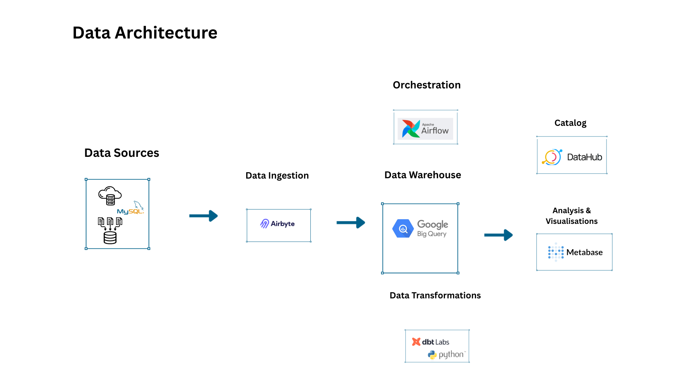
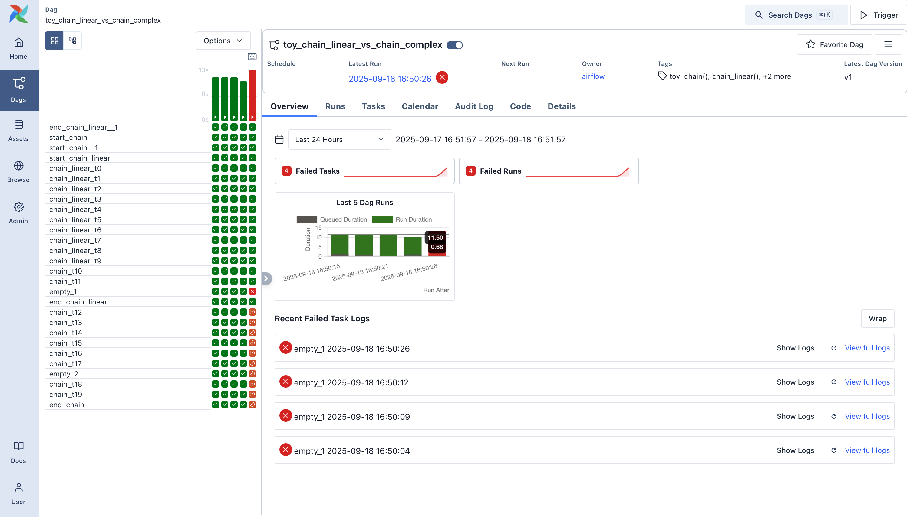

  

 

<em>Duration: 6 months (extended from an initial 3-month internship)</em>

---

# Data-engineering-internship-case-study

## Overview

During my internship within the Data team, I delivered **two production-grade projects** focused on:

* **dbt transformation modelling**
* **BigQuery warehouse development**
* Marketing data integration
* **Pipeline orchestration and monitoring**
* Documentation and BI enablement

All work was deployed to production and is actively used by the business.

---

## Project 1 – Data Platform Documentation & Monitoring

### Key Contributions

* Documented the full data platform architecture in **Figma**
* Standardised visibility across all transformation pipelines
* Built **dbt models** powering analytics datasets
* Implemented **data quality checks and tests**
* Supported **BI dashboard enablement**
* **Orchestrated and monitored DAGs in Airflow**, ensuring smooth execution and timely reruns of failed tasks

---

### Example Data Stack Used

| Tool         | Purpose                                       |
| ------------ | --------------------------------------------- |
| **Airbyte**  | Data ingestion from source systems            |
| **Airflow**  | Orchestration, scheduling, and DAG monitoring |
| **BigQuery** | Data warehouse                                |
| **dbt**      | Data transformation and modelling             |
| **Metabase** | Business Intelligence / reporting             |
| **DataHub**  | Data governance & cataloging                  |

---

<h2 align="center">Data Architecture Diagram</h2>

  

  <em>This diagram shows how data is ingested via Airbyte, orchestrated with Airflow DAGs, transformed using dbt, and delivered to analytics dashboards.</em>

**Flow:**

  <em>Source System (e.g., MySQL / Extracted CSVs) → Airbyte (Ingestion Pipelines) → BigQuery → dbt (staging → intermediate → marts) → Analytics Mart → Airflow DAGs for orchestration & monitoring → Metabase dashboards
.</em>

**Notes:**

* Source data simulates transactional or marketing platform data.
* **Service accounts** securely authenticated dbt and Airflow with BigQuery, following **least-privilege principles**.
* dbt layered modelling applied: **staging → intermediate → marts**.
* Pipelines were orchestrated and monitored using **Airflow**, with **Airbyte handling ingestion**; failed runs were retried after corrections.
* DAG monitoring in Airflow included tracking task execution, retries, and dependencies to ensure timely delivery of analytics datasets.

---

<h2 align="center">Airflow DAG Example</h2>

  

  <em>This DAG is a public example illustrating pipeline orchestration. The screenshot shows a series of failed placeholder tasks (highlighted in red) labeled “empty 1”, “empty 2”, etc., which simulate tasks similar to those I monitored, troubleshooted, and reran during my internship to ensure reliable data pipelines.</em>

## Team Contributions & Workflow

* Owned my own tickets in the team backlog, including pipelines for analysts
* Contributed to **daily team work** and **pipeline monitoring**
* Learned **PowerShell scripting** for automation tasks
* Practiced **branch management, pull requests, and code reviews**:

  * Incorporated feedback and reworked branches before merging to main
  * Peer-reviewed teammates’ analytics engineering work once confident
* Followed **team governance**: merges to main required sign-off by manager **and** a knowledgeable team member

---

## Skills Demonstrated

* Production-style **analytics engineering** (BigQuery, dbt, Airbyte, Airflow)
* **Pipeline orchestration and DAG monitoring**
* **Data modelling** and star schema design
* **Data quality testing**
* Secure cloud access via **GCP service accounts**
* Git workflow & **pull request management**
* **Peer review** and collaborative teamwork
* **BI enablement** (Metabase dashboards)
* **Documentation & visibility** (Figma, DataHub)

---

## Impact

This internship demonstrates:

* Real-world **production data engineering experience**
* Ability to implement **warehouse-centric transformations**
* Understanding of **modern data stack architecture** including orchestration with Airflow and ingestion with Airbyte
* Collaboration in a structured team with **quality & governance processes**
